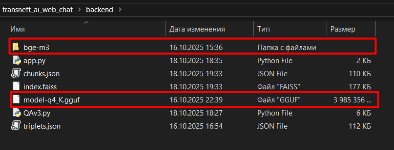
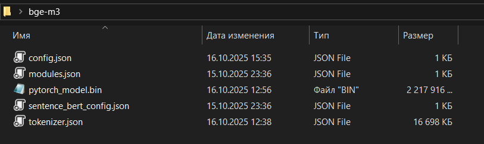

# 🤖 Цифровой консультант ПАО «Транснефть»

Это система ИИ-консультанта, работающего полностью локально на вашем компьютере:  
- **Ретривер**: `BAAI/bge-m3` — ищет релевантные фрагменты из внутренних документов  
- **Ридер**: `Saiga2-7B` — генерирует локаничный ответ на основе найденного контекста


## 📥 Как развернуть систему

### Предварительные требования:

- Установленный **Python 3.10 или новее**  
  → Скачать можно здесь: [https://www.python.org/downloads/](https://www.python.org/downloads/)  
  → **Важно**: при установке на Windows поставьте галочку **«Add Python to PATH»**
- Доступ к интернету (требуется один раз — для загрузки библиотек)

---

### Инструкция по запуску:

1. **Скачайте репозиторий**  
   Нажмите **«Code → Download ZIP»** или клонируйте через Git:
   ```bash
   git clone https://github.com/never-sleeq/Transneft_AI_web_chat-bot
   cd Transneft_AI_web_chat-bot
   ```

2. Перейдите по ссылке хранилища https://drive.google.com/drive/folders/1ZJmImIehbS1g_flHRs58iEk_zs5cJAyX?usp=drive_link , скачайте оттуда папку с моделью bge-m3 и файл модели Saiga2-7B (в формате .guff) и поместите в transneft_ai_web_chat/backend



2. **Убедитесь, что Python установлен**  
   Откройте терминал (командную строку) и выполните:
   ```bash
   python --version
   ```
   Вы должны увидеть версию **3.10 или выше** если python установлен.

3. **Запустите систему**  
   - **Windows**: дважды кликните по файлу `run.bat`  
   - **Linux / macOS**: откройте терминал в папке проекта и выполните:
     ```bash
     chmod +x run.sh
     ./run.sh
     ```

4. **Дождитесь загрузки моделей**  
   В терминале вы увидите сообщение о том что модели загружены, после этого чат-бот готов к использованию.

5. **Откройте в браузере** если он у вас не запустился сразу:  
   👉 [http://localhost:8005](http://localhost:8005)

При возникновении ошибок при первом запуске убедитесь что все компоненты были расположены правильно и попробуйте запуск после перезагрузки системы. 

---

## 📝 Примеры вопросов

Все тестовые вопросы и ответы находятся в файле:  
📄 **`benchmark.xlsx`**

> **Цветовая маркировка в `benchmark.xlsx`:**
> - 🟨 **Жёлтым** — генерации на основе старого бенчмарка (`benchmark_outdated.xlsx`)
> - 🟩 **Зелёным** — генерации на основе актуального бенчмарка
> - 🟥 **Красным** — контексты, которые не были протестированы из-за нехватки времени

---

## 🎥 Видео работы системы

Демонстрация интерфейса и примеров работы:  
▶️ **`test.mp4`** — находится в корневой папке репозитория.

---

## 🤖 Аватар ИИ-консультанта

Анимации аватара расположены в папке:  
📁 `transneft_ai_web_chat/frontend/assets/`

Файлы:
- `idle.gif` — спокойное состояние
- `wave.gif` — приветствие при открытии чата
- `suggest.gif` — предложение задать вопрос
